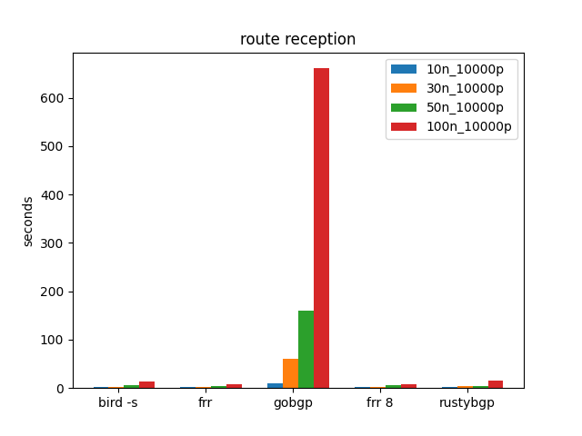
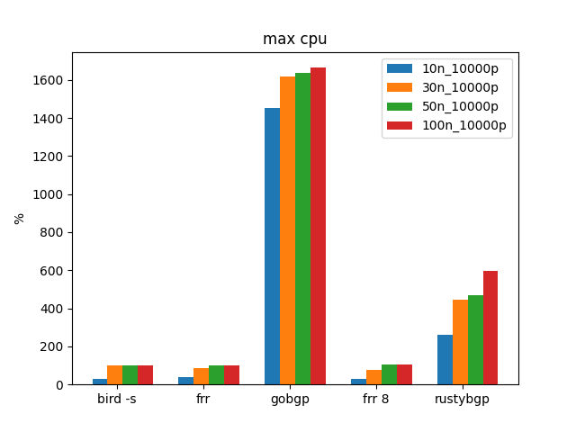
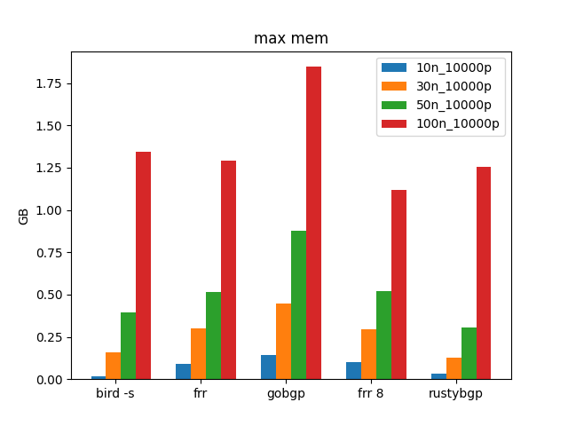

bgperf2
========

bgperf2 is a performance measurement tool for BGP implementation. This was forked from https://github.com/osrg/bgperf and has been changed significantly. 

* [How to install](#how_to_install)
* [How to use](#how_to_use)
* [How bgperf works](https://github.com/osrg/bgperf/blob/master/docs/how_bgperf_works.md)
* [Benchmark remote target](https://github.com/osrg/bgperf/blob/master/docs/benchmark_remote_target.md)
* [MRT injection](https://github.com/osrg/bgperf/blob/master/docs/mrt.md)

## Updates from original bgperf
I've changed bgperf to work with python 3 and work with new versions of all the NOSes. It actually works, the original version that this is a fork of does not work anymore because of newer version of python and each of the routing stacks.

 This version no longer compiles EXABGP or FRR, it gets PIP or containers already created. Quagga has been removed since it doesn't seem to be updated anymore.

To get bgperf to work with all the changes in each stack  I've had to change configuration. I 
don't know if all the features of bgperr still work: I've gotten the simplest version of
each config to work.

Caveats: 

I don't know if adding more policy will still work for all targets.
I haven't tested remote targets.

## What it does
bgperf creates containers of bgp software to be performance tested. It then can run either one off tests "bench" or
a group of tests "batch". It will create graphs to help you understand what the bgp software is doing as well as to
compare across batches. 

bgperf has two main ways of producing prefixes for BGP performance testing. The first way uses either BIRD or EXABGP
to create prefixes and send them. These are pretty lightweight, so it's easy to generate hundreds (or even thousands)
of neighbors with a small amount (hundreds or thousands) or prefixes. BIRD is generally faster, so it is the default
but EXABGP is around for some extra testing.

The second way to generate traffic is by playing back MRT files using [bgpdump2](https://github.com/rtbrick/bgpdump2). 
This is much faster, and is good for playing back internet size tables.  [RouteViews](http://archive.routeviews.org/)
is a good place to get MRT files to play back.


## Prerequisites

* Python 3.7 or later
* Docker
* Sysstat

##  <a name="how_to_install">How to install

```bash
$ git clone https://github.com:jopietsch/bgperf.git
$ cd bgperf
$ pip3 install -r pip-requirements.txt
$ ./bgperf.py --help
usage: bgperf.py [-h] [-b BENCH_NAME] [-d DIR]
                 {doctor,prepare,update,bench,config} ...

BGP performance measuring tool

positional arguments:
  {doctor,prepare,update,bench,config}
    doctor              check env
    prepare             prepare env
    update              pull bgp docker images
    bench               run benchmarks
    config              generate config

optional arguments:
  -h, --help            show this help message and exit
  -b BENCH_NAME, --bench-name BENCH_NAME
  -d DIR, --dir DIR
$ ./bgperf.py prepare
$ ./bgperf.py doctor
docker version ... ok (1.9.1)
bgperf image ... ok
gobgp image ... ok
bird image ... ok
```
## <a name="how_to_use">How to use

Use `bench` command to start benchmark test.
By default, `bgperf` benchmarks [GoBGP](https://github.com/osrg/gobgp).
`bgperf` boots 100 BGP test peers each advertises 100 routes to `GoBGP`.

```bash
$ python3 bgperf.py bench
run monitor
run gobgp
Waiting 5 seconds for neighbor
run tester tester type normal
tester booting.. (100/100)
elapsed: 2sec, cpu: 0.79%, mem: 42.27MB, recved: 10000
gobgp: 2.29.0
Max cpu: 554.03, max mem: 45.71MB
Time since first received prefix: 2
total time: 24.07s

name, target, version, peers, prefixes per peer, neighbor (s), elapsed (s), prefix received (s), exabgp (s), total time, max cpu %, max mem (GB), flags, date,cores,Mem (GB)
gobgp,gobgp,2.29.0,100,100,5,2,0,2,24.07,554,0.045,,2021-08-02,32,62.82GB
```

As you might notice, the interesting statistics are shown twice, once in an easy to read format and the second
in a CSV format to easily copy and paste to do analysis later.

To change a target implementation, use `-t` option.
Currently, `bgperf` supports [BIRD](http://bird.network.cz/) and [FRRouting](https://frrouting.org/)
(other than GoBGP. There is very intial support for[RustyBGP](https://github.com/osrg/rustybgp), partly
because RustyBGP doesn't support all policy that BGPerf tries to use for policy testing. If you just want to
do routes and neighbors then RustyBGP works.

```bash
$ python3 bgperf.py bench -t bird
run monitor
run bird
Waiting 4 seconds for neighbor
run tester tester type normal
tester booting.. (100/100)
elapsed: 1sec, cpu: 1.79%, mem: 110.64MB, recved: 10000
bird: v2.0.8-59-gf761be6b
Max cpu: 1.79, max mem: 110.64MB
Time since first received prefix: 1
total time: 20.73s

name, target, version, peers, prefixes per peer, neighbor (s), elapsed (s), prefix received (s), exabgp (s), total time, max cpu %, max mem (GB), flags, date,cores,Mem (GB)
bird,bird,v2.0.8-59-gf761be6b,100,100,4,1,0,1,20.73,2,0.108,,2021-08-02,32,62.82GB
```

To change a load, use following options.

* `-n` : the number of BGP test peer (default 100)
* `-p` : the number of prefix each peer advertise (default 100)
* `-a` : the number of as-path filter (default 0)
* `-e` : the number of prefix-list filter (default 0)
* `-c` : the number of community-list filter (default 0)
* `-x` : the number of ext-community-list filter (default 0)

```bash
$ python3 bgperf.py bench
run monitor
run gobgp
Waiting 5 seconds for neighbor
run tester tester type normal
tester booting.. (100/100)
elapsed: 2sec, cpu: 0.79%, mem: 42.27MB, recved: 10000
gobgp: 2.29.0
Max cpu: 554.03, max mem: 45.71MB
Time since first received prefix: 2
total time: 24.07s

name, target, version, peers, prefixes per peer, neighbor (s), elapsed (s), prefix received (s), exabgp (s), total time, max cpu %, max mem (GB), flags, date,cores,Mem (GB)
gobgp,gobgp,2.29.0,100,100,5,2,0,2,24.07,554,0.045,,2021-08-02,32,62.82GB
```

For a comprehensive list of options, run `python3 ./bgperf.py bench --help`.

## targets

Targets are the container being tested. bgperf was initially created to create containers of BGP software and 
and make them testable. However, a challenge is the best way to be able to do this over time. For instance, 
the instructions for how to build these software stacks has changed over time. So is the best way to keep up 
to compile the software ourselves or to try to download containers from the open source project themsevles. 
When I originally forked bgperf it hadn't changed in 4 years, so almost none of the containers could be built
and all of the software had changed how they interat. I'm not sure how best to make bgperf work over time.

Right now that is demonstrated most readily with FRR. If you use bench -t FRR it will use a prebuilt FRRouting 
container that is hardcoded to 7.5.1. However, I've also created another target called frr_c, which is a container
that checks FRRouting out of git with the 8.0 tag and builds the container. This container is not automatically
built when you do bgperf bench.

### Testing commercial BGP Stacks

bgperf was originally created to test open source bgp software, so for most containers it compiles the software
and creates a container. For commerical NOSes this doesn't make sense. For those you will need to download
the container images manually and then use bgperf.

For most of these images, bgperf mounts a local directory (usually in /tmp/bgperf) to the container. These
commerical stacks then write back data as root, and set the privleges so that a regular user cannot delete these
files and directories.

bgperf tries to delete /tmp/bgperf before it runs, but it can't with data from these stacks, so you
might need to remove them yourself. The other option is to run bgperf as root \<shrugs\>, that's not a good idea.

```
sudo rm -rf /tmp/bpgperf
```

I have setup multi-threaded support by default in both of these. If you want to do uni-threaded performance
testing you will have to edit config files, which is documented below.

**Warning** The license for these stacks prohibits publishing results. Don't publish results.

#### EOS

[cEOS overview](https://www.arista.com/en/products/software-controlled-container-networking)

To download, after getting an account: https://www.arista.com/en/support/software-download. Make sure you get the cEOS64
image. I didn't the first time, and the results are frustringly slow. After downloading:

``` bash
$ docker import ../NOS/cEOS64-lab-4.27.0F.tar.xz ceos:latest
```

Be sure to use this command for importing: if you don't tag the image as ceos:latest then bgperf
won't be able to find the image.

N.B. EOS takes longer to startup than other BGP software I've tested with bgperf, so don't be alarmed.
However, if it's taken more than 60 seconds to establish a neighbor, something is wrong and start 
looking at logs.

EOS has less clear directions on how to setup multithreading and the consequences. I can't find an authoritative doc to point to.

However, if you want to remove multi-threading support, remove this line from nos_templates/eos.j2

```bash
service routing protocols model multi-agent
```

There is no way to adjust the number of threads being used. For cEOS it appears to be hardcoded
no matter the hardware that you have.

#### Juniper

[Junos cRPD deployment guide](https://www.juniper.net/documentation/us/en/software/crpd/crpd-deployment/index.html)


Download the image to your local machine and then run:

``` bash
$ docker load -i ../NOS/junos-routing-crpd-docker-21.3R1-S1.1.tgz
$ docker tag crpd:21.3R1-S1.1 crpd:latest
```

Be sure you tag the image or bgperf cannot find the image and everything will fail.

bgperf mounts the log directory as /tmp/bgperf/junos/logs, however there are a lot there and most of it
is not relevant. To see if your config worked correctly on startup:

``` bash
$ docker logs bgperf_junos_target
 ```

[Deploying BGP RIB Sharding and Update Threading](https://www.juniper.net/documentation/en_US/day-one-books/DO_BGPSharding.pdf) -- while informative it's weird to me that it's 2021 and getting mult-threaded performance requires a 40 page document. How am I not supposed to think that networking is two decades behind everybody else in software? (This isn't just a Juniper problem by any means)

For multithreading, as mentioned above bgperf sets this up by default in nos_tempaltes/junos.j2

``` bash
processes {
        routing {
            bgp {
                rib-sharding {
                    number-of-shards {{ data.cores }};
                }
                update-threading {
                    number-of-threads {{ data.cores }};
                }
            }
        }       
    }
```

data.cores is set in junos.py and by default it's half the number of availble cores on the test machine, 
with a max of 31, since that is the Junos max. If you want to try setting the threads to something different
you can hard code those values. If you want to see without multi-threading, delete that whole section.

## batch
A  feature called batch lets you run multiple tests, collect all the data, and produces graphs. 
If you run a test that runs out of physical RAM on your machine, linux OOM killer will just kill the process and you'll lose the data from that experiment.

There is an included file batch_example.yaml that shows how it works. You can list the targets that you want
tested in a batch, as well as iterate through prefix count and neighbor count.

If you use a file that looks like this:

```YAML
tests:
  - 
    name: 10K
    neighbors: [10, 30, 50, 100]
    prefixes: [10_000]
    filter_test: [None]
    targets: 
      -
        name: bird
        label: bird -s
        single_table: True
      - 
        name: frr
      -
        name: gobgp
      -
        name: frr_c
        label: frr 8
      -
        name: rustybgp
```

You will get output like this:

```bash
name, target, version, peers, prefixes per peer, neighbor (s), elapsed (s), prefix received (s), exabgp (s), total time, max cpu %, max mem (GB), flags, date,cores,Mem (GB)
bird -s,bird,v2.0.8-59-gf761be6b,10,10000,3,2,0,2,13.9,30,0.015,-s,2021-08-02,32,62.82GB
frr,frr,FRRouting 7.5.1_git (910c507f1541).,10,10000,0,3,0,3,11.58,37,0.089,,2021-08-02,32,62.82GB
gobgp,gobgp,2.29.0,10,10000,6,9,0,9,24.65,1450,0.141,,2021-08-02,32,62.82GB
frr 8,frr_c,FRRouting 8.0-bgperf (489e9d4e8956).,10,10000,0,3,0,3,11.61,31,0.1,,2021-08-02,32,62.82GB
rustybgp,rustybgp,exec,10,10000,4,3,0,3,15.94,262,0.032,,2021-08-02,32,62.82GB
bird -s,bird,v2.0.8-59-gf761be6b,30,10000,4,3,0,3,26.99,100,0.161,-s,2021-08-02,32,62.82GB
frr,frr,FRRouting 7.5.1_git (ab68d18f80c7).,30,10000,0,3,0,3,22.53,86,0.302,,2021-08-02,32,62.82GB
gobgp,gobgp,2.29.0,30,10000,5,61,0,61,85.8,1620,0.447,,2021-08-02,32,62.82GB
frr 8,frr_c,FRRouting 8.0-bgperf (750804dc0e98).,30,10000,0,3,0,3,22.21,78,0.296,,2021-08-02,32,62.82GB
rustybgp,rustybgp,exec,30,10000,4,4,0,4,28.09,446,0.128,,2021-08-02,32,62.82GB
bird -s,bird,v2.0.8-59-gf761be6b,50,10000,3,6,0,6,42.35,100,0.396,-s,2021-08-02,32,62.82GB
frr,frr,FRRouting 7.5.1_git (9e4604a042a6).,50,10000,0,4,0,4,35.48,102,0.513,,2021-08-02,32,62.82GB
gobgp,gobgp,2.29.0,50,10000,4,160,0,160,194.23,1638,0.875,,2021-08-02,32,62.82GB
frr 8,frr_c,FRRouting 8.0-bgperf (eb81873b8335).,50,10000,1,6,0,6,36.69,103,0.52,,2021-08-02,32,62.82GB
rustybgp,rustybgp,exec,50,10000,4,5,0,5,40.74,469,0.307,,2021-08-02,32,62.82GB
bird -s,bird,v2.0.8-59-gf761be6b,100,10000,3,13,0,13,91.68,100,1.343,-s,2021-08-02,32,62.82GB
frr,frr,FRRouting 7.5.1_git (8dc6f2f40d8c).,100,10000,1,7,0,7,74.99,101,1.291,,2021-08-02,32,62.82GB
gobgp,gobgp,2.29.0,100,10000,5,661,0,661,724.83,1664,1.846,,2021-08-02,32,62.82GB
frr 8,frr_c,FRRouting 8.0-bgperf (74ac3704b034).,100,10000,1,8,1,7,70.46,103,1.116,,2021-08-02,32,62.82GB
rustybgp,rustybgp,exec,100,10000,6,16,0,16,80.37,597,1.253,,2021-08-02,32,62.82GB
```

It will create graphs and a CSV file of the output.

And some graphs. These are some of the important ones







## Debugging

If you try to change the config, it's a little tricky to debug what's going on since there are so many containers. What bgperf is doing is creating configs and startup scripts in /tmp/bgperf and then it copies those to the containers before launching them. It creates three containers: bgperf_exabgp_tester_tester, bgperf_\<target\>_target, and bgperf_monitor. If things aren't working, it's probably because the config for the target is not correct. bgperf puts all the log output in /tmp/bgperf/*.log, but what it doesn't do is capture the output of the startup script.

If it doesn't seem to be working, try with 1 peer and 1 route (-n1 -p1) and make sure
that it connecting. If it's just stuck at waiting to connect to the neighbor, then probably the config is wrong and neighbors are not being established between the monitor (gobgp) and the NOS being tested

You'll have to break into gobgp and the test config.

if you want to see what is happening when the test containers starts, after the test is over (or you've killed it), run 
```$ docker exec bgperf_bird_target /root/config/start.sh```
that's what bgperf is doing. It creates a /root/config/start.sh command and is running it, so if you run it manually you can see if that command produces output to help you debug.

to clean up any existing docker containers

```$ docker kill `docker ps -q`; docker rm `docker ps -aq` ```

The startup script is in /tmp/bgperf/\<target\>/start.sh and gets copied to the target as /root/config/start.sh.

In other words, to launch the start.sh and see the output you can run this docker command:

```bash
$ docker exec bgperf_bird_target /root/config/start.sh
bird: I found another BIRD running.

```
In this case, things were already working, so I'll run ps and kill the old bird and start a new one.

```
$ docker exec bgperf_bird_target ps auxww
USER         PID %CPU %MEM    VSZ   RSS TTY      STAT START   TIME COMMAND
root           1  0.0  0.0   3984  2820 ?        Ss   21:21   0:00 bash
root          14  0.0  0.0   4144  2016 ?        Ss   21:21   0:00 bird -c /root/config/bird.conf
root          22  0.0  0.0   5904  2784 ?        Rs   21:22   0:00 ps auxww
$ docker exec bgperf_bird_target kill 14
```

```
$ docker exec bgperf_bird_target /root/config/start.sh
```
No output, so it was just fine.
