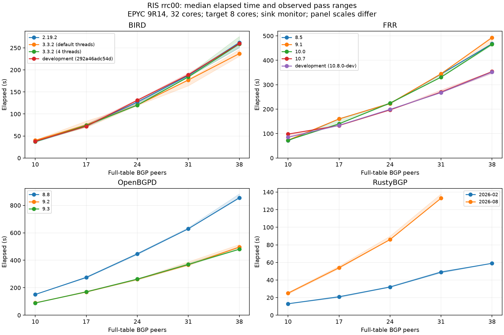

# 2026 BGP daemon comparison

Repository report prepared 2026-10-08 from measurements recorded through 2026-10-06.
This report compares the tested builds and workloads. It is not a ranking of BGP daemons for every deployment.
The [plan](2026-daemon-comparison-plan.md) retains the experiment history, operator decisions and detailed explanations.

## Which data belongs in the comparison?

The main evidence is under [`results/2026/2026-comparison/`](../results/2026/2026-comparison/).
Start with the batch summaries. They already contain the medians, pass ranges, standard deviations,
peak memory observations and variance decisions. CSVs and per-run artifacts provide the audit trail.

| Evidence | Use in this report | Location |
|---|---|---|
| Synthetic, 50 peers × 100,000 unique prefixes | Compare releases on a fixed five-million-prefix table | [synth](../results/2026/2026-comparison/synth/) |
| RIS rrc00, 10 → 38 full-table peers | Compare how elapsed time and memory change as sessions and offered paths increase | [10](../results/2026/2026-comparison/rrc00-n10/), [17](../results/2026/2026-comparison/rrc00-n17/), [24](../results/2026/2026-comparison/rrc00-n24/), [31](../results/2026/2026-comparison/rrc00-n31/), [38](../results/2026/2026-comparison/rrc00-n38/) |
| RustyBGP 2026-08, 24-peer rerun | Replace the cell whose original summary includes an invalid early finish | [rerun](../results/2026/2026-comparison/rrc00-n24-rustybgp-rerun/) |
| RustyBGP dated-head comparison | Check whether the measured behavior persists in the later build | [head](../results/2026/2026-comparison/rustybgp-head/), [unpinned rerun](../results/2026/2026-comparison/rustybgp-head-unpinned-rerun/) |
| Route Views MRT, pinning checks and per-role core changes | Explain export differences, measurement limits and attribution | [mrt](../results/2026/2026-comparison/mrt/), [sink-corrected rerun](../results/2026/2026-comparison/mrt-rustybgp-rerun/), [bias](../results/2026/2026-comparison/bias/), [calib](../results/2026/2026-comparison/calib/), [cores](../results/2026/2026-comparison/cores/) |

Older `2026-baseline` and `2026-timing-validation` results are historical context.
Their GoBGP monitor differs from this comparison's sink. The original `benchmarks/baseline/`
results also use a different CPU. Neither belongs on these curves.

## What we learned, and what was surprising

### The same input does not guarantee the same export work

The first MRT comparison looked like a speed comparison, but the daemons did not export
the same table. On the Route Views RIB, a source tags its routes NO_EXPORT. FRR's
arrival-order-sensitive best-path selection can choose that source more often, withholding
more destinations from the external monitor. BIRD and OpenBGPD's lower-router-ID explanation
is supported by a count simulation; it was not directly traced. Source inspection established
that the tested RustyBGP builds do not enforce NO_EXPORT or NO_ADVERTISE in this configuration.
A lower received count can therefore reflect routing behavior rather than unfinished work.
This is why export counts accompany times and why the scaling curve uses rrc00's selected
peers, which have no NO_EXPORT-tagged routes.
Sources: [Phase 1 investigation](2026-daemon-comparison-plan.md#3-phase-1--questions-answerable-from-existing-evidence)
and [behavior ledger](2026-daemon-comparison-plan.md#8-known-differences-and-deficiencies-between-daemons).

### Release improvements depend on the workload

OpenBGPD's newer releases use less memory and finish later on the unique-prefix synthetic
workload, but finish earlier on the MRT peer curve. BIRD 3.3.2's four-thread arrangement
matches 2.19.2's synthetic median, whereas its default-thread arrangement takes longer;
at the largest MRT step the default-thread arrangement has the lower median.
FRR's release ordering also changes along the peer curve. A result from one table shape
would miss these differences. The [synthetic table](#synthetic-five-million-distinct-prefixes)
and [peer curve](#mrt-the-rrc00-peer-curve) supply the observations; close differences remain
subject to their pass spread.

### RustyBGP's memory change was narrowed to a source change

A controlled bisect placed the MRT memory increase at commit `bd40d626`, which changed the
RIB to track and emit changes for all paths rather than only the best path. That localization
was measured against controls on the same development host. The proposed internal mechanism
comes from reading the diff, rather than profiling allocations. It explains why a workload
with many paths per destination exposes a different cost from unique-prefix synthetic input.
The later [memory curve](#peak-target-memory-along-the-same-curve) shows the practical consequence:
the tested 2026-08 build reaches the free-memory exclusion at the largest step, while the
2026-02 build does not. That is evidence about these builds and this host, not a general
capacity limit. Source: [Phase 1 bisect record](2026-daemon-comparison-plan.md#3-phase-1--questions-answerable-from-existing-evidence).

### Waiting for generators does not prove that generators are too slow

A `tester` finding means the run was still waiting for delivery. A generator can be blocked
because the target is not draining it. In the controlled RustyBGP Route Views experiment,
giving the generators more cores increased their initial CPU burst without moving the
elapsed result beyond pass spread. Their CPU then stayed low while offering continued.
That supports target back-pressure for that experiment; it does not attribute every `tester`
row in the report. Similarly, extra monitor cores did not shorten OpenBGPD's tested
post-injection wait, and the monitor's measured CPU was low. Those controls identified a
target-side wait without establishing which internal component caused it.
Source: [Phase 4 controls and interpretation](2026-daemon-comparison-plan.md#6-phase-4--attribute-on-one-larger-host).

### The tail, session health and CPU arrangement can change the story

FRR often delivered almost all of its Route Views table, paused, then delivered a small
remainder. Its elapsed median can describe that tail rather than bulk table processing;
the reason remains open. RustyBGP's synthetic times changed substantially between pinned
and unpinned arrangements, alongside hold-timer expiries. The later dated-head build
retained the pinned expiries. Neither the correlation nor the core controls establishes
whether expiries cause the slowdown or result from it. A single timing bar would hide both
behaviors. Sources: [behavior ledger](2026-daemon-comparison-plan.md#8-known-differences-and-deficiencies-between-daemons)
and [dated-head experiment](#rustybgp-build-identity-pinning-and-failures).

### The benchmark instrument and stopping rule needed scrutiny too

The original GoBGP monitor's neighbor query holds an exclusive server lock while answering,
blocking UPDATE processing. Its accepted-prefix counter itself is constant-time; the
investigation corrected the tempting explanation that this counter required a table walk.
The sink removed that polling arrangement, but initially handled a malformed RustyBGP
AS_PATH differently from gobgpd. Matching treat-as-withdraw behavior fixed that discrepancy.
The peer sweep also exposed a stopping-rule gap: a stable monitor checkpoint could end a run
before every generator completed. The rule was tightened and the affected cell rerun.
These findings changed which measurements were usable; they were not daemon speedups.
Sources: [monitor investigation](2026-daemon-comparison-plan.md#3-phase-1--questions-answerable-from-existing-evidence),
[sink correction](2026-daemon-comparison-plan.md#5-phase-3--re-run-on-the-current-host-class-then-the-hardware-gate)
and [peer-sweep correction](2026-daemon-comparison-plan.md#9-phase-5--keep-measuring-on-the-m7a8xlarge).

FRR's debug logging is another known difference in the benchmark configuration. Its CPU and
I/O cost has not been isolated, so the report does not attribute a release difference to it
or subtract an assumed overhead. Source: [behavior ledger](2026-daemon-comparison-plan.md#8-known-differences-and-deficiencies-between-daemons).

## Measurement and scope

Routes travel from generators through the target to the sink. `elapsed (s)` is the recorded
convergence duration; it includes generator delivery and the convergence assurance rules.
It is not a measurement of the target's routing algorithm alone. `received` is the sink's
final exported-prefix count. Peak memory is the largest sampled target-container memory
observation across the cell's passes, read from the summary's `max mem (GB).max`.
It is not an average or a limit on the daemon's supported table size.

The synthetic series uses an EPYC 9R14 `m7a.4xlarge` (16 CPUs, about 61.44 GiB),
with `target=0-7,monitor=8-9,testers=10-15`.
The rrc00 series uses an EPYC 9R14 `m7a.8xlarge` (32 CPUs, about 123 GiB),
with `target=0-7,monitor=8-9,testers=10-27`.
Both have one thread per physical core. Container CPU sets are disjoint; they do not
pin the controller or kernel network work. These two series are kept separate.

Each main cell has three passes; each pass repeats the matrix in shuffled order.
The [synthetic config](../benchmarks/2026-comparison-synth.yaml) and
[38-peer config](../benchmarks/2026-comparison-rrc00-n38.yaml) state the workload, pin and seed.
The rrc00 file is `mrt/bview.20260808.0000`, collected 2026-08-08 00:00 UTC.
Each generator offers up to 1,050,000 prefixes from a distinct full-table peer.
Increasing the peer count increases offered paths and sessions; it does not multiply the
number of unique destinations by that count. The selected peer sets are nested.
None of the selected rrc00 peers tags routes NO_EXPORT.

Three passes do not establish a precise ranking among close cells.
The batch variance policy requires the median gap to exceed the sum of the cells'
standard deviations, with a floor at the metric's resolution. It is a screening rule,
not a statistical significance test. Pass ranges are shown where the report compares individual cells.

## Synthetic: five million distinct prefixes

All cells delivered the full table. The generator's queue-side offering measurement does not
resolve enough of the send interval to attribute any cell's time to a limiting component.
Every row's finding is `unresolved`. The measurements remain useful as end-to-end results.

Source: [synth](../results/2026/2026-comparison/synth/2026-comparison-synth.summary.json). Values are copied from the batch summary.

| Tested build | Elapsed passes (s) | Median (s) | Peak target memory (GB) |
|---|---|---|---|
| BIRD 2.19.2 | 78, 76, 78 | 78 | 0.761 |
| BIRD 3.3.2 (default threads) | 99, 98, 99 | 99 | 1.094 |
| BIRD 3.3.2 (4 threads) | 78, 78, 77 | 78 | 1.207 |
| BIRD development (292a46adc54d) | 78, 78, 77 | 78 | 0.775 |
| FRR 8.5 | 72, 72, 72 | 72 | 8.275 |
| FRR 9.1 | 72, 72, 72 | 72 | 8.204 |
| FRR 10.0 | 71, 71, 72 | 71 | 7.664 |
| FRR 10.7 | 45, 51, 46 | 46 | 6.251 |
| FRR development (10.8.0-dev) | 46, 47, 47 | 47 | 5.714 |
| OpenBGPD 8.8 | 610, 617, 605 | 610 | 37.437 |
| OpenBGPD 9.2 | 695, 690, 708 | 695 | 18.686 |
| OpenBGPD 9.3 | 714, 701, 701 | 701 | 18.594 |
| RustyBGP 2026-02 | 73, 76, 76 | 76 | 12.233 |
| RustyBGP 2026-08 (9eeeebbd50) | 154, 168, 146 | 154 | 17.077 |

FRR 10.7 finishes earlier than the tested 8.5, 9.1 and 10.0 builds and uses less peak memory
on this workload. BIRD 3.3.2's default-thread arrangement finishes later than 2.19.2;
the four-thread arrangement has the same median as 2.19.2. OpenBGPD 9.2 and 9.3 use less
peak memory than 8.8 but finish later. These are observations from this table, not explanations
of the internal cause. The summaries do not separate every close pair.

RustyBGP 2026-08's synthetic time needs the hold-timer evidence and pinning context below;
its median alone is an incomplete description.

## MRT: the rrc00 peer curve

Each entry is the batch median elapsed time in seconds. The 24-peer RustyBGP 2026-08 entry
comes from its separate three-pass rerun. Its original summary is not pooled with the rerun.
The 38-peer entry is withheld by the free-memory guardrail, even though those runs finished.

Sources: [rrc00-n10](../results/2026/2026-comparison/rrc00-n10/2026-comparison-rrc00-n10.summary.json), [rrc00-n17](../results/2026/2026-comparison/rrc00-n17/2026-comparison-rrc00-n17.summary.json), [rrc00-n24](../results/2026/2026-comparison/rrc00-n24/2026-comparison-rrc00-n24.summary.json), [rrc00-n31](../results/2026/2026-comparison/rrc00-n31/2026-comparison-rrc00-n31.summary.json), [rrc00-n38](../results/2026/2026-comparison/rrc00-n38/2026-comparison-rrc00-n38.summary.json), [rrc00-n24-rustybgp-rerun](../results/2026/2026-comparison/rrc00-n24-rustybgp-rerun/2026-comparison-rrc00-n24-rustybgp-rerun.summary.json).

| Tested build | 10 peers | 17 peers | 24 peers | 31 peers | 38 peers |
|---|---|---|---|---|---|
| BIRD 2.19.2 | 37 | 73 | 127 | 187 | 262 |
| BIRD 3.3.2 (default threads) | 40 | 75 | 120 | 177 | 237 |
| BIRD 3.3.2 (4 threads) | 37 | 74 | 120 | 184 | 259 |
| BIRD development (292a46adc54d) | 38 | 72 | 131 | 189 | 260 |
| FRR 8.5 | 71 | 160 | 223 | 344 | 468 |
| FRR 9.1 | 73 | 160 | 223 | 345 | 493 |
| FRR 10.0 | 73 | 140 | 225 | 331 | 466 |
| FRR 10.7 | 98 | 133 | 197 | 270 | 354 |
| FRR development (10.8.0-dev) | 85 | 134 | 199 | 268 | 352 |
| OpenBGPD 8.8 | 151 | 275 | 446 | 629 | 855 |
| OpenBGPD 9.2 | 90 | 169 | 261 | 367 | 496 |
| OpenBGPD 9.3 | 89 | 170 | 263 | 370 | 480 |
| RustyBGP 2026-02 | 13 | 21 | 32 | 49 | 59 |
| RustyBGP 2026-08 | 25 | 54 | 86 | 133 | excluded: low free memory |

The figure uses the same medians as the table. Bands show the summary's sampled minimum and
maximum elapsed time, not confidence intervals. Panel scales differ. RustyBGP 2026-08 stops at
31 peers; no line extrapolates its excluded 38-peer point.

OpenBGPD 9.2 and 9.3 finish earlier than 8.8 across this curve, unlike on the synthetic workload.
FRR's relative release ordering changes with peer count. The BIRD arrangements are close at
several steps; the three-pass summaries cannot separate all of them. RustyBGP 2026-02 has
short elapsed times, but the builds do not all export identical prefix counts or implement
identical behavior. That prevents treating this table as a like-for-like universal ranking.

### Peak target memory along the same curve

Values are sampled GB, using the same sources and replacement as the elapsed table.
The excluded point's memory evidence is retained separately below.

| Tested build | 10 peers | 17 peers | 24 peers | 31 peers | 38 peers |
|---|---|---|---|---|---|
| BIRD 2.19.2 | 1.234 | 2.12 | 2.913 | 3.742 | 4.684 |
| BIRD 3.3.2 (default threads) | 1.633 | 2.713 | 3.703 | 4.707 | 5.989 |
| BIRD 3.3.2 (4 threads) | 1.652 | 2.717 | 3.712 | 4.705 | 6.005 |
| BIRD development (292a46adc54d) | 1.242 | 2.12 | 2.911 | 3.744 | 4.693 |
| FRR 8.5 | 5.132 | 8.389 | 11.362 | 14.456 | 17.28 |
| FRR 9.1 | 5.404 | 8.893 | 12.077 | 15.412 | 18.447 |
| FRR 10.0 | 5.369 | 8.727 | 11.87 | 15.137 | 18.134 |
| FRR 10.7 | 6.062 | 9.849 | 13.381 | 17.012 | 20.813 |
| FRR development (10.8.0-dev) | 6.075 | 9.86 | 13.399 | 17.009 | 20.828 |
| OpenBGPD 8.8 | 5.056 | 8.376 | 11.726 | 15.086 | 18.46 |
| OpenBGPD 9.2 | 3.065 | 4.857 | 6.659 | 8.481 | 10.331 |
| OpenBGPD 9.3 | 3.063 | 4.848 | 6.644 | 8.477 | 10.332 |
| RustyBGP 2026-02 | 2.329 | 4.169 | 5.898 | 7.701 | 10.247 |
| RustyBGP 2026-08 | 11.386 | 26.59 | 47.877 | 73.829 | excluded |

RustyBGP 2026-08's memory growth is the strongest capacity warning in this series.
Its 38-peer runs reached 110.789 GB peak target memory,
and free memory fell as low as 1.314 GB.
All three passes fell below the operator's 15% free-memory guardrail, so their elapsed-time
results are excluded. This establishes the observed pressure on this host, not a maximum
supported peer count or a prediction for a larger machine.

### Existing bgperf2 graphs: why the 38-peer cell is excluded

These two graphs were generated by bgperf2 during RustyBGP 2026-08's 38-peer pass 2.
They show target-container memory and host free memory over the same run. They illustrate
an excluded observation; they do not add a point to the accepted elapsed-time curve.

The graphs explain the pressure behind the exclusion. The precise sampled peak and free-memory
floor above come from the batch summary, rather than estimates read from pixels. The individual
run's graph is not a median across passes. Other bgperf2 graphs remain linked through the result
directories: batch bars can include excluded rows and historical labels, so they are not used
as the report's accepted comparison curve.

### Export volume and pass spread at 38 peers

The prefix counts travel with the times. A range denotes variation between passes.
Attribution is recorded in the plan and per-run events; it is not inferred from the speed ordering.

Source: [rrc00-n38](../results/2026/2026-comparison/rrc00-n38/2026-comparison-rrc00-n38.summary.json).

| Tested build | Elapsed passes (s) | Median (s) | Received prefixes, min–max |
|---|---|---|---|
| BIRD 2.19.2 | 262, 250, 264 | 262 | 1,131,785 |
| BIRD 3.3.2 (default threads) | 237, 246, 231 | 237 | 1,131,785 |
| BIRD 3.3.2 (4 threads) | 276, 251, 259 | 259 | 1,131,785 |
| BIRD development (292a46adc54d) | 258, 260, 260 | 260 | 1,131,785 |
| FRR 8.5 | 466, 468, 468 | 468 | 1,131,987 |
| FRR 9.1 | 493, 466, 498 | 493 | 1,131,987 |
| FRR 10.0 | 466, 462, 467 | 466 | 1,131,932–1,131,987 |
| FRR 10.7 | 355, 347, 354 | 354 | 1,131,724–1,131,779 |
| FRR development (10.8.0-dev) | 353, 347, 352 | 352 | 1,131,779 |
| OpenBGPD 8.8 | 884, 855, 851 | 855 | 1,131,785 |
| OpenBGPD 9.2 | 493, 515, 496 | 496 | 1,131,785 |
| OpenBGPD 9.3 | 480, 479, 496 | 480 | 1,131,785 |
| RustyBGP 2026-02 | 59, 59, 59 | 59 | 1,131,993 |

RustyBGP 2026-02's two `unresolved` findings at this step withhold attribution because the
fleet injection was not resolved at poll resolution. They do not exclude its elapsed time.
By contrast, RustyBGP 2026-08's memory pressure excludes its time from this curve.
The [behavior ledger](2026-daemon-comparison-plan.md#8-known-differences-and-deficiencies-between-daemons)
records export differences and sink treat-as-withdraw events. The remaining count differences
on rrc00 are not fully explained.

## RustyBGP: build identity, pinning and failures

The original `rustybgp default` image was commit `9eeeebbd50`, subsequently labeled `2026-08`.
It was not current upstream master. The dated-head experiment tested `2026-09`, commit
`783d6dfd00`, against that same retagged binary. The builds resolved dependencies at different
times and carry no Cargo.lock, so the experiment compares source and dependency graph together.

The head comparison uses five passes per cell on the larger host. Unpinned means access to
that host's 32 cores; it cannot be compared with the smaller host's unpinned runs.

Sources: [rustybgp-head](../results/2026/2026-comparison/rustybgp-head/2026-comparison-rustybgp-head-synth.summary.json), [rustybgp-head](../results/2026/2026-comparison/rustybgp-head/2026-comparison-rustybgp-head-synth-unpinned.summary.json), [rustybgp-head](../results/2026/2026-comparison/rustybgp-head/2026-comparison-rustybgp-head-mrt.summary.json).

| Arrangement | Build | Successful elapsed passes (s) | Median (s) | Observations |
|---|---|---|---|---|
| Synthetic, pinned | RustyBGP 2026-08 | 148, 165, 107, 155, 160 | 155 | 5 of 5 |
| Synthetic, pinned | RustyBGP 2026-09 | 149, 175, 152, 143, 144 | 149 | 5 of 5 |
| Synthetic, unpinned | RustyBGP 2026-08 | 43, 44, 39, 37, 47 | 43 | 5 of 5 |
| Synthetic, unpinned | RustyBGP 2026-09 | 41, 43, 39, 46 | 42 | 4 of 5 |
| Route Views MRT, pinned | RustyBGP 2026-08 | 25, 24, 23, 25, 24 | 24 | 5 of 5 |
| Route Views MRT, pinned | RustyBGP 2026-09 | 20, 19, 25, 24, 24 | 24 | 5 of 5 |

The head build retained hold-timer expiries on every pinned synthetic pass. Neither build
expired a generator session in the unpinned synthetic or pinned MRT tests. The expiry count
does not consistently order the times, and causal direction is unresolved. These tests show
an arrangement-dependent result, not a steady release speedup.

The original 2026-09 unpinned cell has one failed pass, not an unrun pass. It stopped with no
received prefixes; whether the target stalled, crashed or was late was not established.
The separate five-pass rerun completed every pass, with median 40 s.
The rerun does not erase the original failure or pool its observations into the original median.
Source: [rustybgp-head-unpinned-rerun](../results/2026/2026-comparison/rustybgp-head-unpinned-rerun/2026-comparison-rustybgp-head-unpinned-rerun.summary.json).

## What the supporting experiments establish

The [Phase 4 attribution record](2026-daemon-comparison-plan.md#6-phase-4--attribute-on-one-larger-host)
identifies OpenBGPD 9.3's Route Views post-injection wait as the target's: increasing monitor
cores did not shorten it beyond pass spread, while measured monitor CPU stayed below its
available cores. That conclusion applies to the tested workload and arrangement. The automated
finding remains `target_or_monitor`; a general attribution rule has not been validated on
independent controls. The accepted smaller-host baseline carries a stated +2 s offset in the
larger-host OpenBGPD MRT check.

The original Route Views MRT workload contains a NO_EXPORT source. FRR's final export volume
falls short of that workload's check-point, and its times also include an unexplained delivery
tail. Those rows are useful for explaining behavior and instrument limits, but are not used
as FRR throughput rankings. The rrc00 series avoids the selected peers' NO_EXPORT confounder.
A malformed RustyBGP AS_PATH also required a sink correction and a separate rerun; the failed
original rows remain evidence.

## How to audit the report

- `*.summary.json`: read the published statistics and variance decisions. This report computes
  no new medians, speedup percentages or rankings.
- `*.csv`: inspect individual pass values, sampled CPU/memory and host metadata.
- `*.events.json`: inspect convergence witnesses, generator completion, delivery evidence,
  findings and confounders. `role_cpu` appears where it was measured.
- `*.versions.json`: identify the actual daemon, generator and sink builds and bgperf2 revision.
  BIRD development reports `2.19.0+branch.master.292a46adc54d`; FRR development reports
  `10.8.0-dev-my-manual-build`. These labels describe measured builds, not current master.
- `*.tester-health.json`: inspect hold-timer expiry and other generator error samples where emitted.
- [`2026-daemon-comparison-report.claims.json`](2026-daemon-comparison-report.claims.json):
  exact source, cell, metric, field and expected value for every summary figure used in the
  report and figure. Values were resolved against the summaries before this document was written.

The original 24-peer RustyBGP early finish and all three 38-peer memory-pressure rows remain
on disk but do not enter the reported curve. The 24-peer rerun is a separate cell summary;
the original whole-matrix variance decisions are not recomputed after that replacement.
Raw per-second stats and the existing per-run PNGs are diagnostic material rather than extra
comparison observations. They need not all appear in a reader-facing report.

This repository report is the selected deliverable. No external publication or upstream
notification has been made, and no additional benchmark was run to prepare it.
